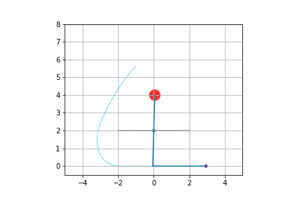
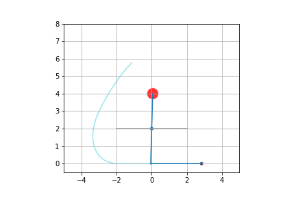

# Trebuchet
## Optimize energy transfer of a trebuchet.

This is a python script I used to teach myself and explore some of the possibilities offed by `sympy` and `scipy` (especially ODE numerical integration and optimization)

1. Derive differential equations with analytical mechanics in `sympy`
2. Turn symbolic expressions into functions with `lambdify()` 
3. Simulate system using an event to detect projectile takeoff and switch equations with `scipy.integrate`
4. Optimize model parameters to increase energy transfer with `scipy.optimize`
5. Animate with `matplotlib.animation`

I am quite amazed by all the things free software now has to offer for scientific computing...

The trebuchet I'm simulating has an axle free to move on a horizontal line. It seems to naturally have a quite good transfer ratio. In fact the optimization improves it only a little.

Before otpimisation:
 

After optimisation

I hate all weapons in the world. But I can't help it, trebuchets are fun...
 
